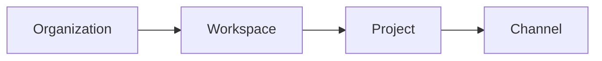

# 7. Workspace has exactly one human execution owner

Date: 2026-09-04

## Status

Accepted

## Context

gabot is a personal AI-team workspace (issue #3). Multi-human workspaces make it
ambiguous whose GitHub, Slack, or Google authority a background bot inherits when
it acts.

## Decision

Every Workspace has exactly one human execution owner
(`workspaces.owner_user_id` NOT NULL). Organization admins and auditors govern
platform resources; they do not become downstream execution principals.

On first login, `upsertUser` provisions org `org-gabot` membership, workspace
`ws-{userId}`, a default project, and a personal General channel.

A client may talk to multiple backends. Each backend workspace still has one
owner.

Workspace carries the single human owner. Project and Channel inherit that
ownership; they do not introduce a second execution principal.

## Consequences

Stop auto-adding every user to a global `general` channel. Channel ids are unique
per workspace. Bots that need owner-delegated tools always know which human's
authority they run under.
