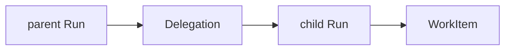

# 9. Every autonomous effectful execution has a durable Run

Date: 2026-09-04

## Status

Accepted

## Context

Interactive turns and delegated or routine work both cause effectful tool calls.
Mastra's in-memory A2A task store does not survive replicas ([ADR
0005](0005-ag-ui-and-a2a.md)). In-process bot recursion hides parent/child
authority and cannot be audited after a crash.

## Decision

Every autonomous effectful execution creates a gabot Run persisted in
PostgreSQL. The AG-UI `runId` equals the gabot Run id.

Bot-to-bot collaboration is parent Run → Delegation → child Run →
`work_items(kind=run.execute)`, not in-process recursion and not Mastra
in-memory A2A tasks.

P0 statuses: `queued`, `running`, `succeeded`, `failed`, `cancelled`.

This evolves ADR 0005. It does not replace AG-UI or A2A: people still stream
AG-UI events through the API; discovery still uses A2A cards.

## Consequences

Runs, delegations, and work items are restart-safe and auditable. Gateway and
UI can attach events to a stable Run id. Status vocabulary can grow later; P0
clients only depend on the five statuses above.
