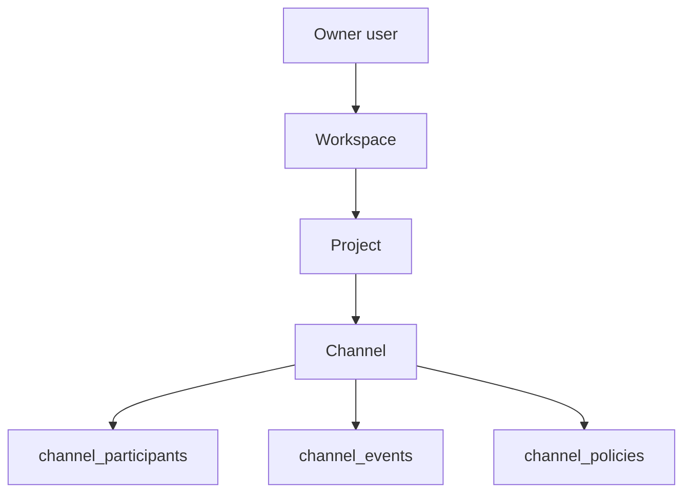

# 13. Live channel model is participants and project

Date: 2026-09-05

## Status

Superseded by [0014](0014-enterprise-workspace-contracts.md)

## Context

P0 provisioned org → workspace → project → channel tables, plus leftover
`channel_memberships` and `channel_agents` from the shared General channel era.
Runtime already uses `channel_participants`. Issue #3 still needs Project as a
real parent of Channel without introducing a second human execution owner.

## Decision

The live collaboration model is:

- One workspace per human owner (`UNIQUE (workspaces.owner_user_id)`).
- Channels belong to a Project (`channels.project_id` NOT NULL, FK).
- Membership is `channel_participants` (`user` | `bot`). HTTP may add or remove
  bots only; humans are not invited through this API.
- Optional `channel_policies` intersect workspace grants (inherit when empty).

`channel_memberships` and `channel_agents` stay in migrate SQL so existing
databases keep applying idempotently. Do not seed, query, or expose them.

This does not supersede [ADR 0008](0008-channel-durable-collaboration-context.md).

## Consequences

Extra projects are additive; the default personal project remains the
workspace's default `projectId`. New features must not grow
`workspace_members` or revive the leftover membership tables.
