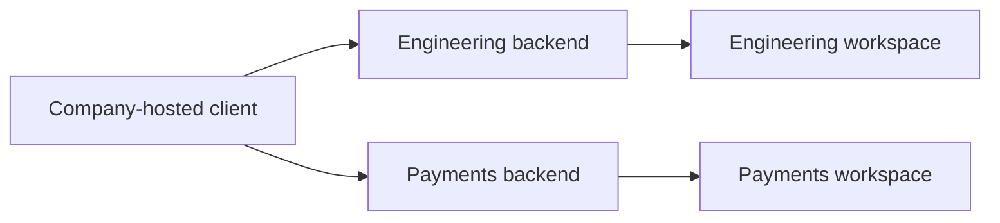

# 14. Enterprise workspace contracts

Date: 2026-09-06

## Status

Accepted

Supersedes [0007](0007-workspace-single-execution-owner.md) and
[0013](0013-live-channel-model-participants-and-project.md). Amends
[0004](0004-identity-ports.md), [0009](0009-durable-run.md), and
[0012](0012-catalog-connect-grant-invoke.md). Product charter [#2](https://github.com/yu-iskw/gabot/issues/2)
and architecture [#3](https://github.com/yu-iskw/gabot/issues/3).

## Context

The personal unique-owner prototype on `feat/openbot-equivalent-coworker` cannot
express enterprise teammates. A workspace had exactly one human owner. Users were
joined by email. Resource ids were local strings. Built-in computer scope and
channel "no human invite" rules followed from that model.

Issues #2 and #3 adopt independently governed backends, multi-human membership,
and a company-hosted client that switches workspaces like Slack. Executable
contracts belong in `@gabot/common` before membership or UI work (#8, #9).

## Decision

Keep backend identity and workspace identity separate. The first release deploys
one backend per workspace. Local ids may collide across origins. Every resource
reference is origin, backend id, workspace id, type, and local id.

Store people as an identity key: trusted issuer, optional tenant, and subject.
Email and display name are attributes. They are not the join key.

A workspace has many human members. Management roles do not imply downstream
authority. Each durable run names `initiatedBy`, `executionPrincipal`,
`accountableSponsor`, and `outputAudience`.

Catalog stages stay distinct: publish, admit, install, connect, grant, invoke.
Install does not authorize invoke.

The client is company-hosted. It talks to the selected backend over a session
bound to that origin. There is no cross-workspace search, memory, credential
reuse, delegation, or data transfer in the first release. Shared company name,
email domain, or identity provider is not trust.

Channels still belong to a project. `channel_participants` remains the
collaboration roster. Humans join through workspace membership, not a
bot-only participant API. That membership store is issue #8.

`PeopleAuthPort` stays a port ([ADR 0004](0004-identity-ports.md)). Issue #8
replaces email-keyed `VerifiedPerson` upsert. Prototype helpers such as
`personalWorkspaceId` stay for the unique-owner code until that issue.

## Consequences

Two backends may both use `ws-1` / `ch-general` / `coder` without colliding in
client caches, events, or navigation. Unique-owner SQL
(`workspaces_owner_user_id_uidx`) and `users.email UNIQUE` are prototype
invariants, not the target model. Federation helpers in `@gabot/common` fail
closed. Computer removal is [ADR 0016](0016-built-in-computer-out-of-product-scope.md).
Schema cutover is [ADR 0017](0017-clean-bootstrap-prototype-is-reference.md).
