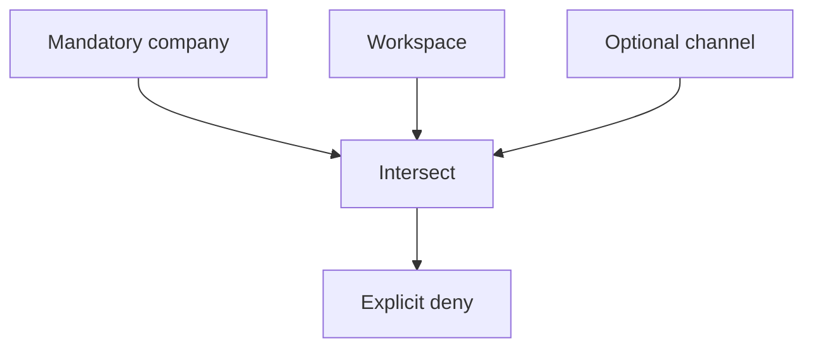

# 15. Policy layers inherit, deny-empty, and intersect

Date: 2026-09-06

## Status

Accepted

## Context

`matchChannelPolicy` treats "no rows for this capability" as inherit. The
primary key `(channel_id, capability, resource)` cannot store an empty allow-set,
so a channel cannot deny every resource while the workspace grant still exists.

Issue #7 requires a documented algebra: missing optional restriction inherits;
empty allowed set denies; mandatory layers intersect. Alternatives inside one
allow-set combine. Explicit deny wins. A subordinate layer may narrow a
mandatory restriction and must not expand it.

## Decision

`@gabot/common` encodes layers as optional or mandatory allow-sets plus an
explicit deny list.

- Optional unrestricted (missing) leaves the combined allow-set unchanged.
- An allow-set with no values denies every resource.
- Independent layers intersect. Values listed together in one layer are
  alternatives.
- Explicit deny is applied after intersection and always wins.

`optionalAllowFromChannelRows` maps the prototype table onto this algebra:
no rows become unrestricted, not empty deny. Empty deny is a first-class value
(`emptyAllowSet`) for later schema.

Intersect company or deployment mandatory policy, workspace policy, optional
project/channel restrictions, principal authority, installation, grants, run
ceiling, and approvals. Workspace baseline for privileged capabilities remains
default deny at the grant layer.

## Consequences

Gateway code may keep `matchChannelPolicy` until #8/#12 persist empty deny.
New policy work must call `combinePolicyLayers` / `resourcePermitted`. Tests
cover inherit, empty deny, intersection, and explicit deny.
