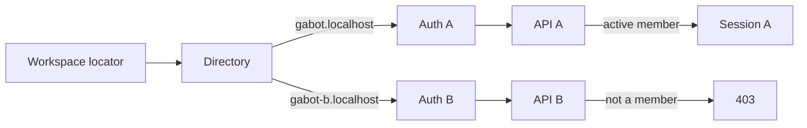

# 21. Per-backend membership-gated workspace login

Date: 2026-09-07

## Status

Accepted

Amends [0004](0004-identity-ports.md), [0014](0014-enterprise-workspace-contracts.md),
and [0020](0020-client-workspace-directory-and-navigation-urls.md).

## Context

ADR 0014 binds a company-hosted client session to one backend origin. ADR 0020
maps a workspace slug to that origin. Compose profile `dual` runs two APIs, but
people login still used one Auth emulator and one `GABOT_TOKEN_AUDIENCE`. The SPA
signed in once, then the BFF forwarded the same Bearer token to whichever
upstream the slug selected.

A valid IdP token was enough to `upsertUser` on the request path. Non-members
received `/api/me` 200 with `membershipStatus: null`. Adding or retiring a
workspace could not isolate the identity plane.

## Decision

Login order is **select workspace → authenticate to that backend’s IdP →
require active membership**.

The workspace directory entry is:

`{ slug, displayName, upstream, backendId, workspaceId, authDomain, tokenAudience, domain? }`.

- **authDomain**: browser IdP host (Compose emulator `127.0.0.1:9099`, production
  Identity Platform auth domain).
- **tokenAudience**: must match that backend’s `GABOT_TOKEN_AUDIENCE`.
- **domain**: optional Slack-like locator handle (`gabot.localhost`).

The client initializes Firebase Auth for the selected entry only. It does not
create a global Auth app at boot. Switching workspace signs out the previous
IdP session and rebinds Auth. The same Bearer token is not reused across
backends.

`requireUser` verifies the token audience, then requires an existing principal
with active `workspace_members` status. Strangers are `403 { error: "not_a_member" }`
and are not upserted. Bootstrap admins (`INITIAL_ADMIN_*`) may still be
provisioned on first login. Invites and admin people APIs remain the provisioning
path for everyone else.

Compose profile `dual` runs a second Auth emulator (`auth-b`, project
`demo-gabot-b`, loopback `127.0.0.1:9199`) so backend B rejects tokens minted for
A.

## Consequences

Adding a workspace is a directory row, an IdP tenant or emulator, and an API
stack. Retiring one is remove the row, disable that tenant, and take down that
API; other workspace sessions stay valid. Playwright mints tokens from the
emulator that matches the target API. Cookie/OIDC login hosted on the API origin
is out of scope (a later ADR if Bearer must leave the browser).
